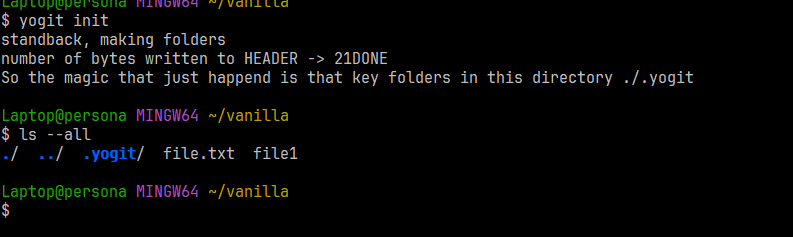
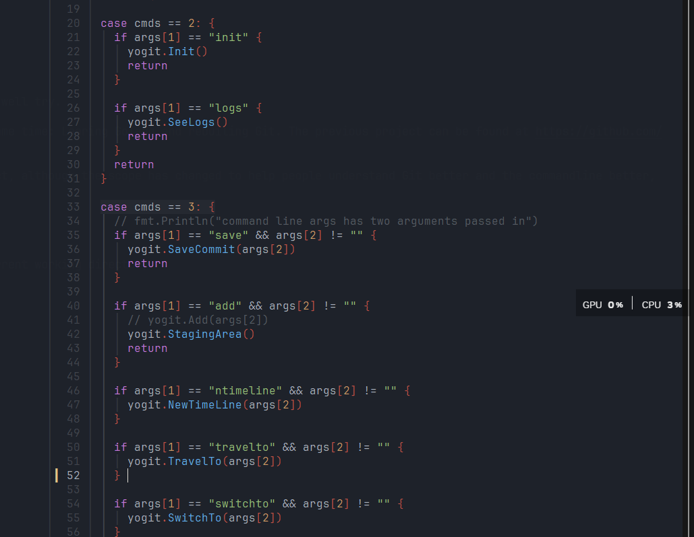
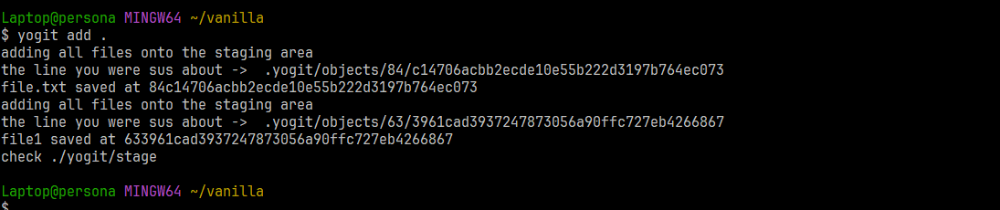
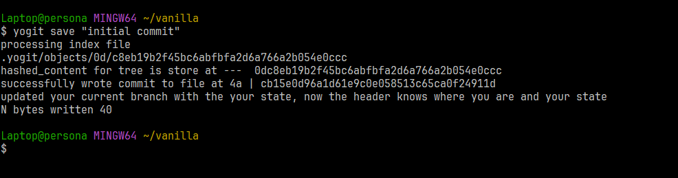
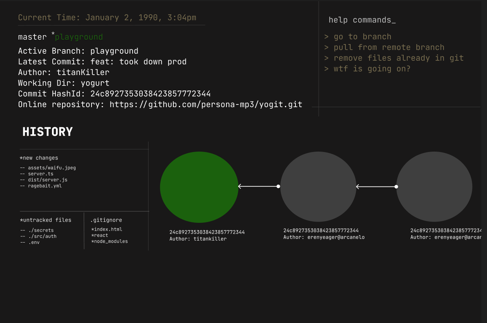

# yogit

The main intention of yogit was for two things:
1. Learn Golang 
2. While learning Go, to build something.
3. Git. Why Git? I use it almost everyday, might as well try and actually understand it.

This is was pratically doubling two things at the same time: Learing Golang and rebuiling Git. The previous project can be found at [ ***git_project*** ](https://github.com/persona-mp3/git_project.git). There I explain major innerworkings of how Git works like is Data structure using a Directed Acyclic Graph, zlib compression, concepts of pointers and branches, basically like a time machine. I also made used of visual diagrams to actually make the learning nice

But this is a practical version for the whole project, although the scope has changed to help people understand Git better and the commandline better, this is where I will stop for now.

## Basic Commands
```yogit init``` 

This basically makes a new .yogit folder in your current working directory


### See main.go for basic commands,



# yogit


```yogit add .```

This basically adds all files in the current directory to staging area just like how git does



The logs are basically suppose to make the user whats going on whenver they run certain commands and not look at it like magic, and that is why I left the files uncompressed, as at the moment.


```yogit save "message goes in here" ``` 

To save a commit, just like ```git commit -m "inital commit"``` 



### Other features 
1. Checkout
2. Switching branches
3. Logging


# FUTURE IMPROVEMENTS

As stated with scope above, as most people are new to the command line like I am, I also plan on adding a nice terminal user interface, as seen below



Other major integrations that I would like to include is actually helping with the merge conflicts as most people said its hard to understand.
