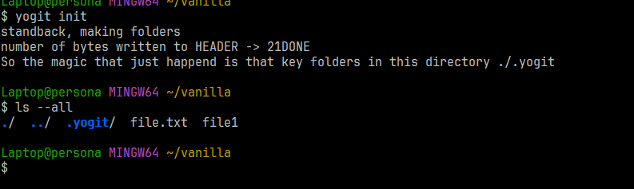
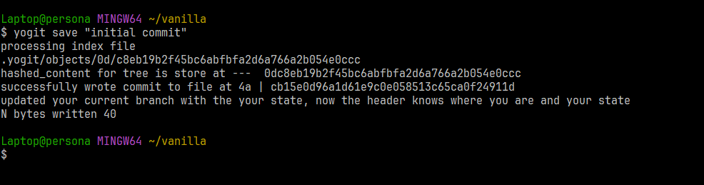
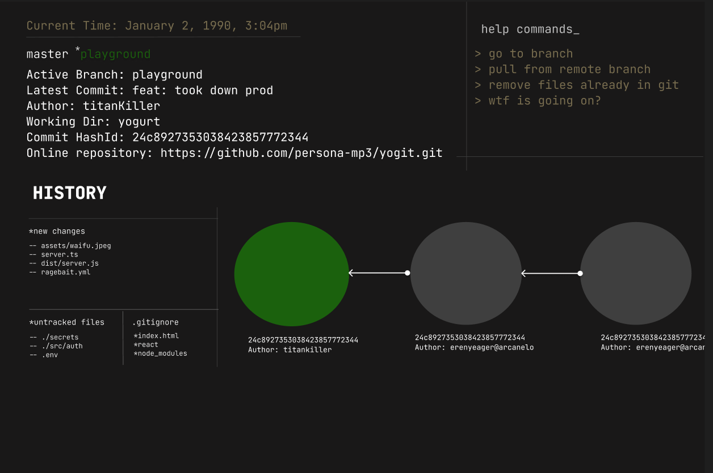

# yogit

The main intention of yogit was for two things:
1. Learn Golang 
2. While learning Go, to build something.
3. Git. Why Git? I use it almost everyday, might as well try and actually understand it.

This is was pratically doubling two things at the same time: Learing Golang and rebuiling Git. The previous project can be found at [ git_project](https://github.com/persona-mp3/git_project.git). There I explain major innerworkings of how Git works like is Data structure using a Directed Acyclic Graph, zlib compression, concepts of pointers and branches, basically like a time machine. I also made used of visual diagrams to actually make the learning nice

But this is a practical version for the whole project, although the scope has changed to help people understand Git better and the commandline better, this is where I will stop for now.

# Installation
``` bash 
git clone https://github.com/persona-mp3/yogit.git
cd yogit
```

This will clone thewhole repository into your current working folder and you change youir current directory to yogit

You will see this script called *setup.sh*. If using any vim emulator you can use it to edit or take a look at the code

``` bash
userName@users ~/yogit $ bash setup.sh
```

That will set up yogit to be globally available on your system. To check it run this 

``` bash 
yogit
 ->  WELCOME TO YOGIT
``` 

To see how it works you can go into any test folder of your choice and run basic git commands and it works exactly the same. The logs are left intentionally to make the user aware of whats going on instead of looking at Git like a complex tool, although it is, its simple too, with the right understanding.

### side note -> You can configure the commandline arguments to suit your interests and it won't affect anything inside the main.go file

```bash
yogit init

// this creates a .yogit folder in the current working directory just like .git
``` 



### See main.go for basic commands,

            yogit add . -> git add .
            yogit save "" -> git commit -m ""
            yogit ntimeline "" -> git checkout -b "branch_name"
            yogit traveto "" -> git checkout "commit_id"
            yogit switchto "" -> git checkout [branch_name]


# yogit instructions


```bash
yogit add .
```

This basically adds all files in the current directory to staging area just like how git does


```bash
yogit save "message goes in here" 
``` 

To save a commit, just like ```git commit -m "inital commit"``` 



### Other features 
1. Checkout
2. Switching branches
3. Logging
<br>

# FUTURE IMPROVEMENTS

As stated with scope above, as most people are new to the command line like I am, I also plan on adding a nice terminal user interface, as seen below



Other major integrations that I would like to include is actually helping with the merge conflicts as most people said its hard to understand.


# CONTRIBUTING

### Clone the repo
Make sure you have the go compiler installed at their offical [website](https://go.dev/doc/install)
```bash
git clone https://github.com/persona-mp3/yogit.git
cd yogit
```

### Run the project
```bash
go run main.go 

# you can refer to the instructions as regular command line args or set it up globally
# go run main.go init 
# go run main.go init 
```
