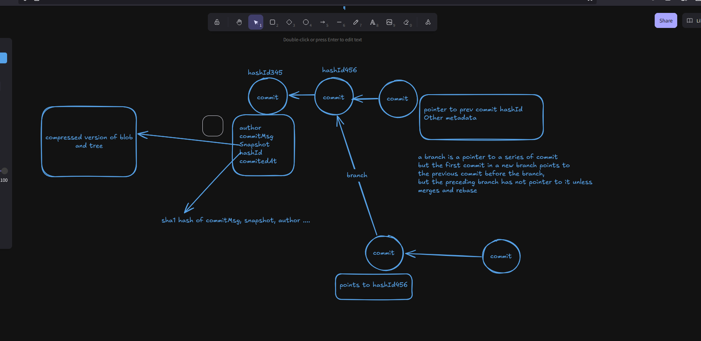
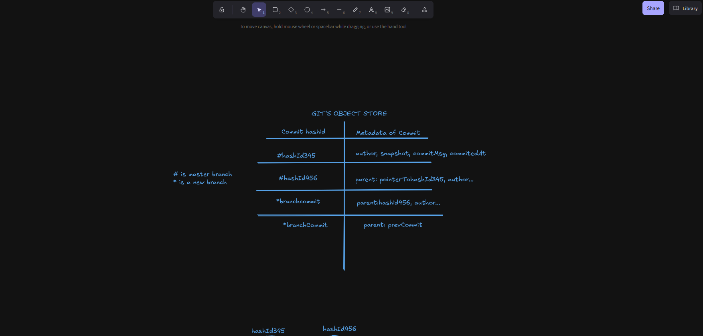

With this project, I'm recreating the architecture of GIT taking into account the underlying structure of commits, sanpshot, branches and other features 


#Key Concepts
- Directed Acyclic Graphs: Git uses this data structure as the relationships between different commits. Each commit points to a previous commit as a parent for easy backtracking. With this feature, no cycles are formed in this data structure.




- Branches: Branches are pointers to a specific line of commits. A branch points to the latest commit in a sequence. For example, Master will point to the 5th commit in its "timeline" and a new branch "dev" will only point to commits in it's time line.

An analogy would be like, a Green Drone (##master) will only watch what happens in the Section1 (#commits) , while the Red Drone (##dev) will only watch what happens in Section2. But Section1 && Section2 share a common wall, to be more specific, Section2 will always point to Section1s latest change, still adhering to the DAG Model.


- Commits: Commits are basically objects that store details about a particular project in time. Think about it like this

    ```go
    type Commit struct {
        Author string
        CommitMsg string
        HashId string
        Parent *HashId
        Snapshot *Tree
        CommitedAt time.Time
    }
    ```

Where the Tree is a compressed and hashed version of the current state of the working folder , files and it's content where all its content are comperessed into a hashcode. The Parent is the HashId of the previous Commit. In a case where that commit is the first, it will just reference itself.


In Typescript, think about making a type of object that has this properties

    ```js
    interface Commit {
        Author: string,
        CommitMsg: string,
        HashId: string | number
    }
    ```

These are however just simplified versions of what the Commit object look like but is abstracted enough to get a general overview.


- Git Database: Git stores all these commits and their content in key value pairs, where the key is the ##HashId of the Commit, and the Value is it's metadata. 




This is written in Go as if you would need to run the code, you would need to ensure that you have the compiler installed on your device at the their website. 

To check if it was successfully installed, run this:

```go --version``


Then to run the main file:
```go run git.go```


As of the moment, I've not started using Go's memory management to convert it into a proper CLI Interface, but currently working on the architecture. This is my first attempt at Go and building this project  will esentially teach me Go's Basics at least, and then maybe try the behemoth, C
